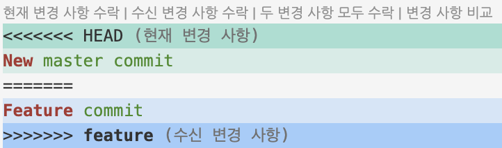

**Merge**는 `두 브랜치의 변경 사항을 하나로 합치는` Git의 기능입니다.

주로 개발 중인 브랜치를 메인 브랜치에 통합하거나, 다양한 기능 브랜치를 하나로 합칠 때 사용됩니다. Merge는 브랜치의 변경 사항을 병합(commit merge)하는 과정에서 합쳐진 시점을 나타내는 `병합 커밋`을 생성합니다.
<br>

#### Merge의 사용 사례

1. **기능 통합**
    기능 브랜치에서 작업한 내용을 메인 브랜치에 병합할 때 사용합니다.
    <br>    

2. **버그 수정 통합**
    버그 수정 브랜치에서 수정한 내용을 메인 브랜치에 병합할 때 사용합니다.
    <br>

3. **동시 작업 통합**
    여러 개발자들이 각자의 브랜치에서 작업한 내용을 하나로 합칠 때 사용합니다.
    <br>

#### Merge의 단계

1. ( **준비** ) 병합할 두 브랜치를 준비합니다.
2. ( **병합** ) 병합할 브랜치로 체크아웃한 후 다른 브랜치를 병합합니다.
    ```bash
    # master 브랜치로 체크아웃 후 feature 브랜치를 병합
    git checkout master
    git merge feature
    ```
3. ( **충돌 해결** ) 병합 과정에서 충돌이 발생하면 충돌을 해결하고 변경 사항을 커밋합니다.
    ```bash
    # 충돌 해결 후 변경 사항 커밋
    git add conflicted_file
    git commit -m "Resolve merge conflict"
    ```
    <br>

#### Merge 전략

Git에서는 다양한 Merge 전략을 제공합니다. 기본적으로는 `"Fast-forward"`와 `"3-way merge"`를 사용합니다.

- **Fast-forward**
    병합 대상 브랜치가 현재 브랜치의 자식 브랜치인 경우, 단순히 포인터를 앞으로 이동시켜 병합합니다. 병합 커밋이 생성되지 않습니다.
    ```bash
    git checkout master
    git merge --ff-only feature
    ```

- **3-way merge**
    두 브랜치에 공통 조상이 있는 경우, 공통 조상과 두 브랜치의 현재 상태를 비교하여 병합 커밋을 생성합니다.
    ```bash
    git checkout master
    git merge feature
    ```

---
#### Merge 과정


```bash
<<<<<<< HEAD
New master commit
=======
Feature commit
>>>>>>> feature
```


1. **HEAD**
    HEAD 부분은 현재 체크아웃된 브랜치( `master` )의 최신 커밋입니다.
    병합 작업을 수행할 때는 병합이 수행되는 브랜치의 최신 커밋을 의미합니다.
    <br>

2. **BASE**
    충돌 파일에서는 표시되지 않지만, 병합 충돌이 발생했을 때, 두 브랜치가 공통으로 가지고 있는 마지막 커밋을 의미합니다. merge base라고도 하며, 두 브랜치가 공통으로 가지는 조상(commit)입니다.
    <br>

3. **OURS**
    현재 체크아웃된 브랜치(즉, HEAD)의 변경 사항을 의미합니다. 병합 충돌이 발생했을 때, 충돌을 해결하는 과정에서 우리의 변경 사항을 유지하고 싶을 때 사용합니다.
    <br>

4. **THEIRS**
    병합하려는 브랜치(feature)의 변경 사항입니다.
    병합 충돌이 발생했을 때, 상대 브랜치의 변경 사항을 유지하고 싶을 때 사용합니다.
    <br>

