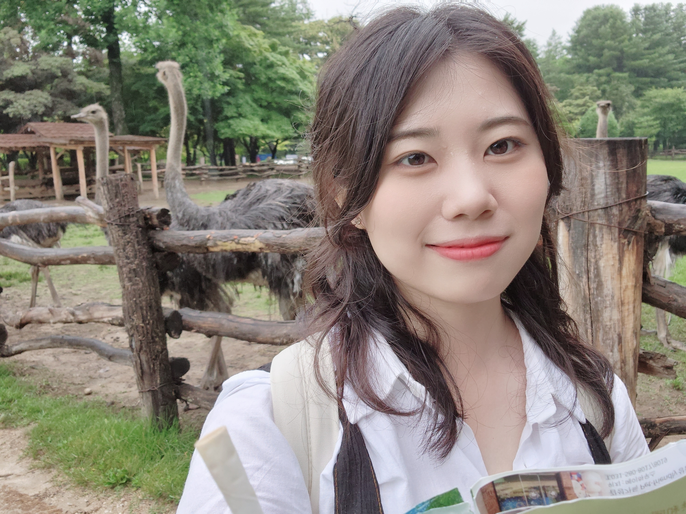

 
 

블로그에 방문해주신 여러분을 환영합니다. 저는 한국의 옛 수도, 문화재가 많은 경주에서 멋진 학창 시절을 보낸 사람입니다. 고등학교 때는 수학과 과학을 깊게 공부했고, 서울에서 대학 생활을 하며 개발 공부를 했습니다. 긍정적인 성격을 가졌으며, 호기심이 많고 추진력이 강합니다.

가까운 미래에 웹개발 백엔드 직무로 취업하여 커리어를 쌓는 것을 목표로 하고 있습니다.
 
언젠가는 스위스에서 아름다운 경관을 바라보며 코딩하는 휴가를 보내는 꿈을 가지고 있습니다. ㅎㅎ

이 블로그는 제가 개발 공부를 위해 지식을 정리한 공간입니다. 저와 비슷하게 개발 공부를 하는 사회 초년생 여러분께 이 블로그가 많은 도움이 되었으면 좋겠습니다.

감사합니다! 즐거운 시간 보내세요 :)
 
 
 
 

 Welcome to the blog.   I have spent a great school days in Gyeongju, where many Korean capital and cultural assets are many. I studied development.   I had a positive personality, I was curious and strong.
 

 

 We are aiming to build a career by getting a job as a web development backend in the near future.
  
 One day, I have a dream of spending a vacation in Switzerland while looking at the beautiful scenery. lol
 

 

 This blog is a space that summarizes my knowledge for development.
 

 thank you! have a great time :)
 
 
 

contact : <a href="mailto:sohuikim2020@naver.com">sohuikim2020@naver.com</a>
 

[notion portfolio - kor](https://tiny-helicopter-4d0.notion.site/cdd9676f8af34393aab175904a01e58b?pvs=4) 
[notion portfolio - eng](https://tiny-helicopter-4d0.notion.site/cdd9676f8af34393aab175904a01e58b?pvs=4)

