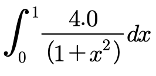
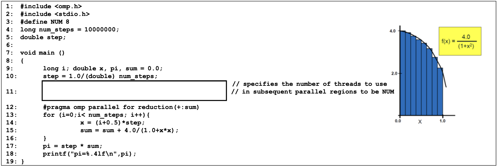

**[ 2023. Multicore Computing ]**
<br>

> Question1.
> Fill in the blanks (a)~(g) with the most appropriate English words

1. (a.     ) is a proprietary compiler by Nvidia intended for use with CUDA. CUDA code runs on both the CPU and GPU. ( same as (a) ) separates these two parts and sends host code (the part of code which will be run on the CPU) to a C/C++ compiler like GCC or Intel C++ Compiler (ICC) or Microsoft Visual C++ Compiler, and sends the device code (the part which will run on the GPU) to the GPU. The device code is further compiled by ( same as (a) ).
<br>

2. (b.    ) is a C++ template library for CUDA based on the **Standard Template Library (STL)**. ( same as (b) ) allows you to implement high performance parallel applications with minimal programming effort through a high-level interface that is fully interoperable with CUDA C. This means ( same as (b) ) is a library for high-level parallel algorithms and data structures that utilize GPU based on CUDA. It is a parallel analog of C++ STL and provides a productive way to program CUDA.


3. The name of the OpenMP library function that returns the current thread index is (c.         ).


4. In CUDA device, threads within the same (d.         ) can access the same data in a (e.         ) memory which is much faster than global memory.

<br>

5. (f.          ) is a type of OpenMP schedule that is similar to the dynamic schedule, but the size of the portion of work decreases as the program runs.


6. [In OpenMP] By default, all variables declared outside a parallel block are shared variables except (g.          ).


7. In CUDA, (a. ) is a group of 32 threads where multiprocessors execute the same instruction at each clock cycle.


8. CUDA keyword (b. ) indicates a function that runs on device, can only be callable from host code, and should have (c. ) return type.

9. CUDA keyword (d. ) indicates a function that runs on host and can only be callable from host code.


10. CUDA keyword (e. ) indicates a function that runs on device and can only be callable from device code.


11. [In CUDA] Because it is on-chip, (f. ) is much faster than local and global memory. In fact, ( same as (f) ) latency is roughly 100x lower than uncached global memory latency. ( same as (f) ) is allocated per (g. ).

12. So, ( same as (f) ) enables cooperation between threads in ( same as (g) ).

13. In OpenMP, variables declared in a parallel block are always (h. ).

14. The word ‘mutex’ is from the abbreviation of (i. Mut Ex ).

15. [In pthread] pthread_mutex_trylock behaves identically to pthread_mutex_lock, except that it does not (j. ) the calling thread if the given mutex is already locked by another thread. Instead, pthread_mutex_trylock (k. ) immediately with the error code EBUSY.

16. In pthread programming, (l. ) subroutine blocks the calling thread until the specified thread terminates. The programmer is able to obtain the target thread's termination return status if it was specified in the target thread's call to (m. ).

17. GPGPU stands for (a. G ) (b. P ) computing on Graphics Processing Units. GPGPU is the use of GPU, which typically handles computation only for graphics, to perform computation in applications traditionally handled by CPU.

18.  CUDA C/C++ keyword __global__ indicates a function
- is executed on (c. ), and
- is called from (d. ). Any call to a __global__ function must specify (e. ) for that call.

19. In GPU, a stream multiprocessor (SM) is basically (f. ) processor that executes a warp simultaneously.

20. [In OpenMP] By default, all variables declared outside a parallel block are (g. ), except (h. ) variable, which is (i. ).

21. (1) What does the function pthread_join do? Explain pthread_join with sufficient details. ( )

22. (2) What is the purpose of the argument variable A? Explain A with sufficient details. ( )

23. (3) What is the purpose of the argument variable B? Explain B with sufficient details. ( )


24. In CUDA device, threads within the same (a. ) can access the same data in a (b. ) memory which is much fster than global memory.

25.  In OpenMP, using (c. ) directive, individual code blocks are distributed over threads.

26. [OpenMP] By default, all variables declared outside a parallel block are (d. ), except the (e. ) variable, which is (f. ).

27. (i) static scheduling : ( )
28. (ii) dynamic scheduling : ( )


29. In OpenMP, by default all variables declared outside a parallel block are shared, except for (a. ) variable which is private.

30.  In OpenMP, values of private variables are (b. ) on entry and exit of parallel region.

31. In GPU, a stream multiprocessor (SM) is basically (c. ) processor that executes a warp simultaneously.

32. [In CUDA] Any call to a __global__ function must specify (d. ) for that call. List three other main characteristics of __global__ function : - (e. ) - (f. ) - (g. )

33. [In CUDA] Threads share data via shared memory within (h. ).

34. In pthread programming, (i. ) subroutine blocks the calling thread until the specified thread terminates. The programmer is able to obtain the target thread's termination return status if it was specified in the target thread's call to (j. ).


35. In CUDA, threads within a block can cooperate through (a. ). Threads in different blocks cannot cooperate.

36.  In CUDA, (b. ) is a group of threads where multiprocessor executes the same instruction at each clock cycle.

37. (c. ) is the ability of a system, network, or process to handle a growing amount of work in a capable manner or its ability to be enlarged to accommodate that growth.

38. Main advantages of PSRS (Parallel Sorting by Regular Sampling) over parallel quicksort and hyper-quicksort algorithms, are - Better (d. ) - Repeated communications of a same value are avoided - The number of processes does not have to be (e. ), which is required by the other two algorithms.

39. [In OpenMP] By default, all variables declared outside a parallel block are shared variables except (f. ).

40. (a. ) is the overhead in traffic to and from memory as a result of multiple threads concurrently attempting to access the same locations in memory.

41. (b. ) is an atomic instruction used in multithreading to achieve synchronization. It compares the contents of a memory location to a given value and, only if they are the same, modifies the contents of that memory location to a given new value. This is done as a single atomic operation. The atomicity guarantees that the new value is calculated based on up-to-date information; if the value had been updated by another thread in the meantime, the write would (c. ).

42. The divide-and-conquer paradigm improves program modularity, and often leads to simple and efficient algorithms. Since the subproblems created in the divide step are often (d. ), they can be solved in parallel. If the subproblems are solved recursively, each recursive divide step generates even more (d. ) subproblems to be solved in parallel. In order to obtain a highly parallel algorithm, it is often necessary to parallelize the (e. ) and (f. ) steps, too

43. GPU is specialized for highly (g. ) computation, where the same program is executed on many data elements in parallel.

44. In pthread programming, (h. ) subroutine blocks the calling thread until the specified thread terminates. The programmer is able to obtain the target thread's termination return status if it was specified in the target thread's call to (i. ).

 ※ You should fill out the blank (h) and the blank (i) with appropriate pthread library function names. 2. (12points) In pthread programming, there are several ways in which a pthread (thread) can be terminated. List at least four ways.
(i) : ( )
(ii) : ( )
(iii) : ( )
(iv) : ( )


> Question2.
> Following program intends to compute the approximation value of numerical integration with multiple number of threads (i.e. 8 threads) using OpenMP.

<center></center>
<br>

1. Insert in line 11 appropriate code that specifies the number of threads to use in subsequent parallel regions to be NUM.
<br>
2. a) The following program is not correct and may generate a wrong result. Which part in the program is wrong? : line ( )
<br>
3. b) Why is the program wrong? Your answer : ( [use less than 20 English words] )
<br>
4. c) How can you modify the program code for correction? Modify or insert your code directly in the following code.

```
#include <omp.h>
#include <stdio.h>
#define NUM 8

long num_steps = 10000000;
double step;

void main ()
{
    long i; double x, pi, sum = 0.0;
    step = 1.0/(double) num_steps;
  
    // specifies the number of threads to use
  
    // in subsequent parallel regions to be NUM

    #pragma omp parallel for reduction(+:sum)
    for (i=0;i< num_steps; i++){
        x = (i+0.5)*step;
        sum = sum + 4.0/(1.0+x*x);
    }
  
    pi = step * sum;
    printf("pi=%.4lf\n",pi);
}
```


<br>

**1. 스레드 수 지정 (11번 라인에 삽입할 코드)**

- pragma omp parallel for num_threads(NUM) reduction(+:sum)
- 병렬 영역에서 사용할 스레드의 수를 NUM으로 지정하고, 병렬 처리에서 사용되는 변수 sum에 대해 리덕션을 적용합니다.
<br>

**2-a. 잘못된 부분 지정**

- 잘못된 코드의 부분은 주로 sum 변수를 다루는 라인에서 발생할 가능성이 높습니다. 정확한 라인 번호는 제시된 코드 스니펫에서 확인할 수 없으나, 일반적으로 sum 업데이트 부분(예를 들면 for 루프 안에서의 sum += ...;)에서 문제가 발생합니다.
<br>

**2-b. 프로그램이 잘못된 이유**
"공유 변수 sum에 대한 동기화 누락" 때문입니다.
공유 변수에 대한 접근을 동기화하지 않으면, 다중 스레드 환경에서 데이터 레이스(data race)가 발생할 수 있습니다. 이는 잘못된 계산 결과를 초래할 수 있습니다.
<br>

**4-c. 프로그램 코드 수정**
프로그램 코드를 수정하여 정확하게 동작하게 하기 위해서는 sum 변수에 대한 리덕션을 명시적으로 지정해주어야 합니다. 수정된 코드는 다음과 같습니다

```
#include <omp.h>
#include <stdio.h>
#define NUM 8
long num_steps = 100000000;
double step;

int main () {
    long i; double x, pi, sum = 0.0;
    step = 1.0/(double) num_steps;

    #pragma omp parallel for num_threads(NUM) reduction(+:sum)
    for (i = 0; i < num_steps; i++) {
        x = (i + 0.5) * step;
        sum += 4.0 / (1.0 + x * x);
    }

    pi = step * sum;
    printf("pi=%.4lf\n", pi);
}
```

<br>

- 리덕션 (reduction(+:sum)): 이 지시어는 각 스레드로 하여금 sum의 개인 복사본을 가지고 계산을 수행하도록 하고, 모든 스레드의 계산이 끝난 후 이들 값을 모두 합치도록 합니다.
- num_threads(NUM): 병렬 블록을 실행할 스레드의 수를 NUM으로 설정합니다.
- 각 스레드가 독립적으로 작업을 수행하고 결과를 안전하게 합치게 함으로써 정확한 계산 결과를 얻을 수 있습니다.
<br>

> Question3.

- (a) What is the meaning of the OpenMP directive “#pragma omp parallel sections”?
  **English**: Divides code into independent sections to run in parallel.
  **Korean**: 코드를 독립적인 섹션으로 나누어 병렬로 실행하게 하는 지시어입니다.
<br>
- (b) What is the main similarity between private variables and firstprivate variables in OpenMP?
  **English**: Both are unique to each thread.
  **Korean**: 둘 다 각 스레드마다 고유합니다.
<br>
- (c) What is the main difference between private variables and firstprivate variables in OpenMP?
  **(i) private**
  **English**: Uninitialized for each thread.
  **Korean**: 각 스레드에 대해 초기화되지 않음.
  **(ii) firstprivate**
  **English**: Initialized with the value from outside.
  **Korean**: 외부 값으로 초기화됨.
